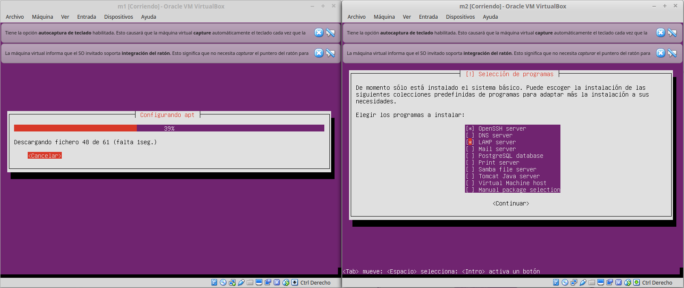
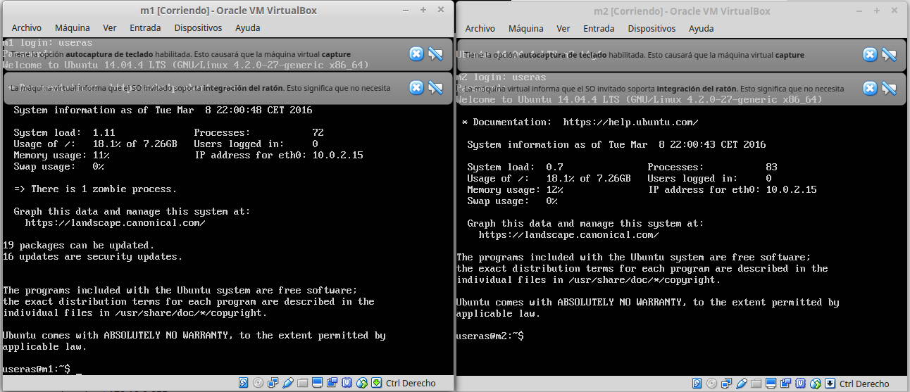
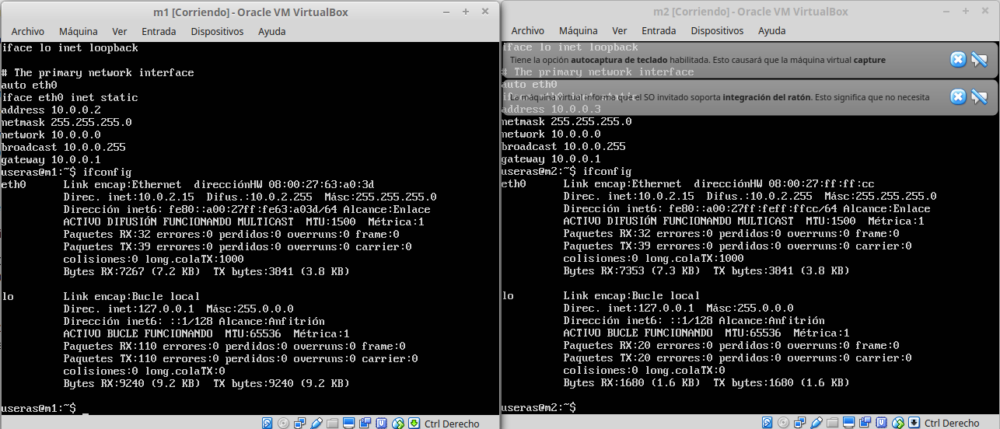
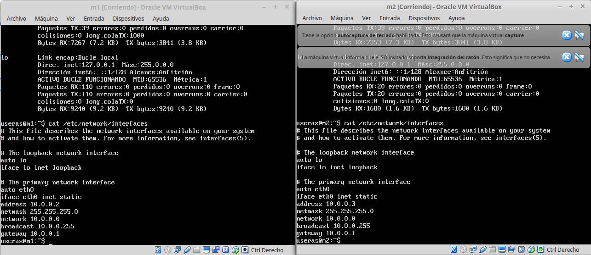

#PRACTICA 1

Instalamos ubuntu server siguiendo la guia de instalación

Ya tenemos instalado ubuntu server en las dos maquinas virtuales.

Ahora comprobamos las ip y vemos que se le ha asignado la misma ip
a las dos maquinas.

Por tanto, procedemos a cambiar las ip ejecutando:

    sudo nano /etc/network/interfaces

Y editamos el archivo con los diferentes parametros que se muestran en
la siguiente imagen
