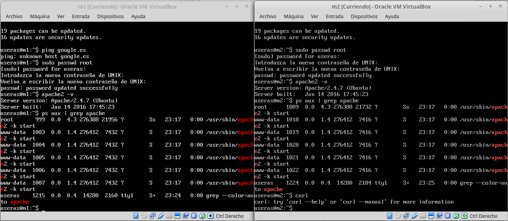
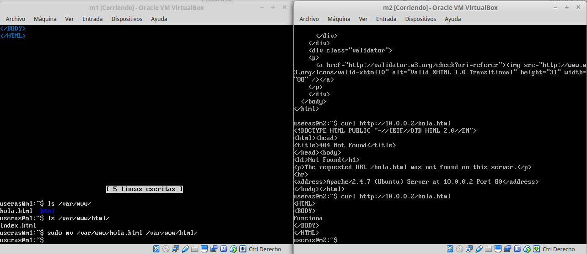

#PRACTICA 1

##Instalacion de Ubuntu Server 14.04.4 en las maquinas virtuales

Instalamos ubuntu server siguiendo la guia de instalación, seleccionando
que se instale SSH y LAMP

Ya tenemos instalado ubuntu server en las dos maquinas virtuales.

Comprobamos las versiones de apache y vemos que esta en ejecución

###cURL

Creamos el archivo hola.html y hacemos curl para ver que se atiende la peticion.
Al principio no funciona porque no existe el archivo. Después lo movemos al directorio
html y ya si podemos realizar la petición correctamente.

##Asignacion de IP en las VM

Ahora comprobamos las ip y vemos que se le ha asignado la misma ip
a las dos maquinas.

Por tanto, procedemos a cambiar las ip ejecutando:

    sudo nano /etc/network/interfaces

Y editamos el archivo con los diferentes parametros que se muestran en
la siguiente imagen, poniendo la asignacion de ip estatica

Ya tenemos las maquinas virtuales funcionando y comunicadas entre ellas.