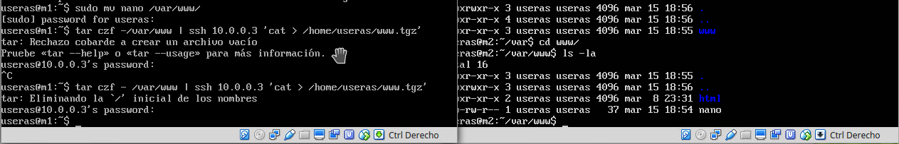
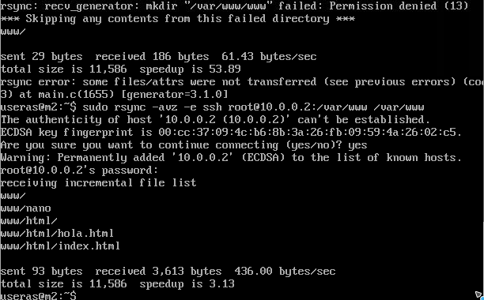
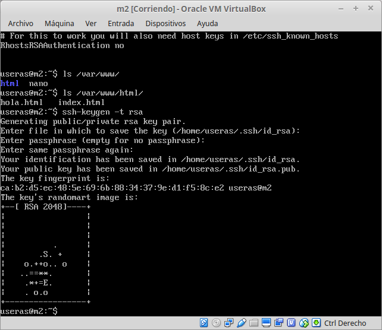
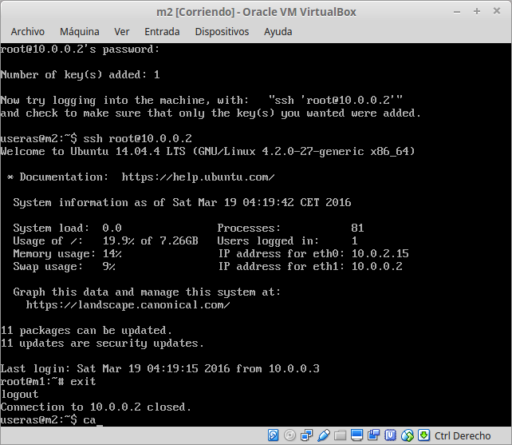
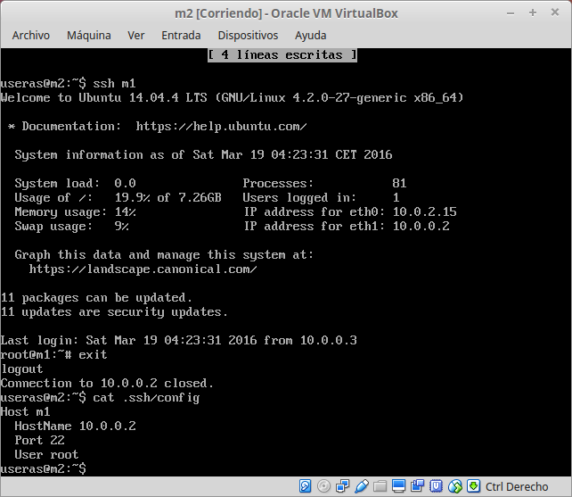
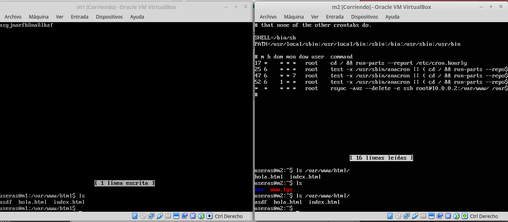
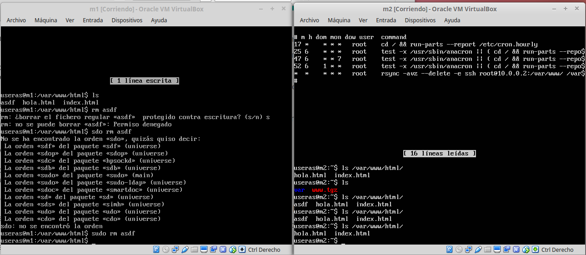

#PRACTICA 2

##Crear un tar con los ficheros locales en el equipo remoto

Para hacer la copia remota ejecutamos el comando
    tar czf - /var/www | ssh 10.0.0.3 'cat > /home/useras/www.tgz'

Al final vemos como en m2 tenemos la carpeta *www* ya descomprimida que contiene
el directorio *html* y el archivo *nano* que habia creado en m1

##Ejecucion de *rsync*

Para realizar una copia remota y no tener que copiar todo el contenido, utilizamos
rsync que sólo copia las diferencias entre los directorios.
Ejecutamos lo siguiente desde m2 para copiar el contenido de m1 en m2
    sudo rsync -avz -e ssh root@10.0.0.2:/var/www/ /var/www/

Antes hemos tenido que aceptar el acceso root por ssh en **/etc/ssh/sshd_config**
Podemos ver que se ha realizado la copia correctamente en la imagen anterior, aunque
se generó una subcarpeta añadida llamada **www** porque me faltó poner la **/** al
final de */var/www*

##Configurar ssh para que no pida contraseña

Para realizar esto, debemos generar una clave, copiar la pública en la maquina remota.
Así ya no nos pedirá mas la contraseña.

En la siguiente imagen generamos la clave RSA con
    ssh-keygen -t rsa
Y pulsamos enter hasta que termina

Copiamos la clave en el equipo remoto

También añadir, que hay que crear el archivo **authorized_keys** en el directorio */root/.ssh*
con la clave publica de la m2 porque sino pide la contraseña al realizar el comando *rsync*

Además, he generado un fichero de configuración en *~/.ssh/config* y en */root/.ssh/config*
con la información de acceso a m1 y así acceder fácilmente ejecutando.
    ssh m1
Ya sin solicitar contraseña ni tener que poner usuario e ip siempre

##Creamos tarea en crontab para ejecutar rsync

Para finalizar la práctica, añadiremos la línea siguiente en el archivo */etc/crontab* para que
se realice cada minuto el comando *rsync* y tengamos sincronizadas las carpetas */var/www*

    * *   * * *  root rsync -avz --delete -e ssh root@10.0.0.2:/var/www/ /var/www/

En la imagen se muestra la edición del archivo y cómo queda la carpeta *html* sincronizada

Si borramos el archivo *asdf*, podemos ver que en como mucho un minuto tenemos actualizada
la carpeta y el archivo estará borrado

