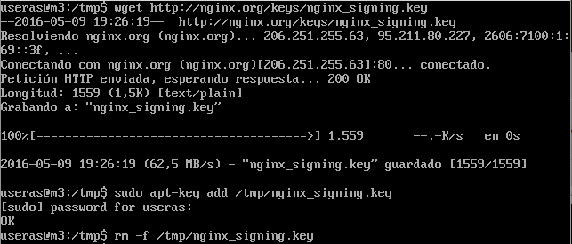
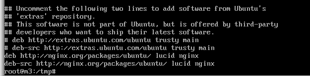
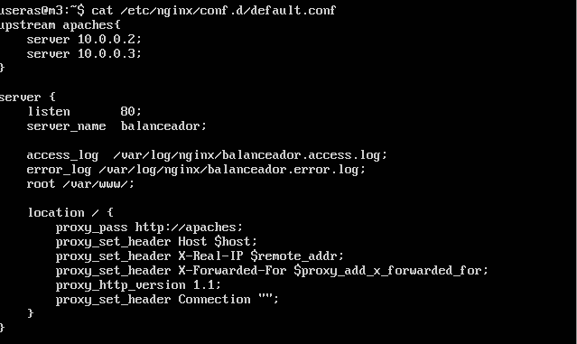
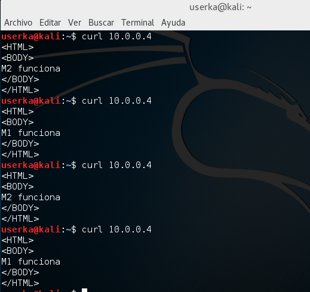
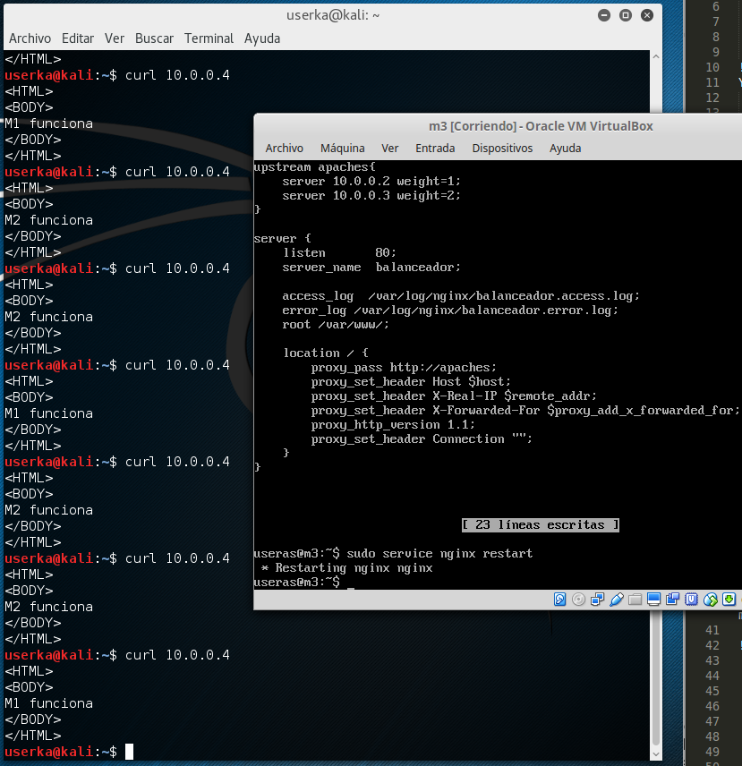
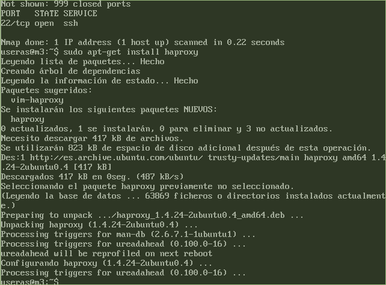
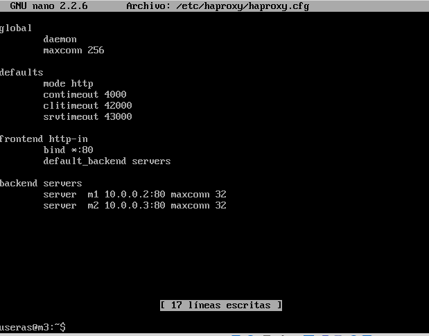
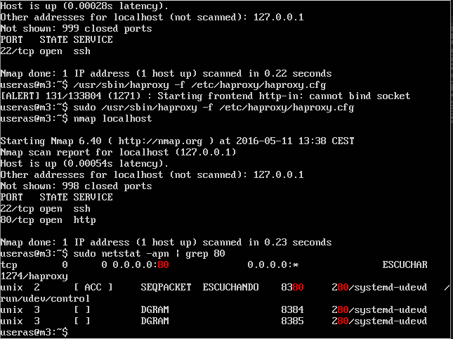
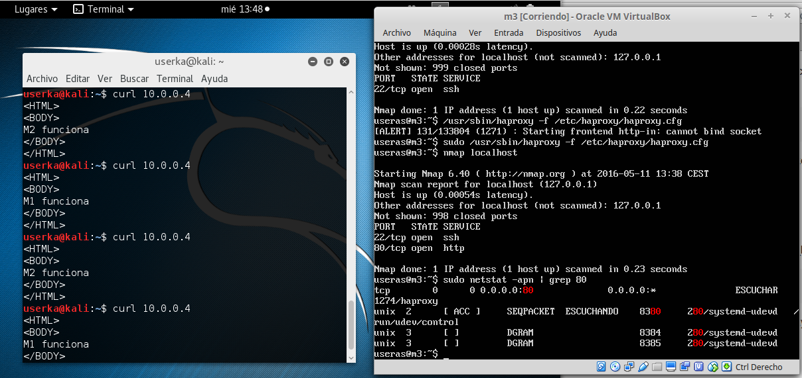

#PRACTICA 3

##Instalación de NGINX

Primero añadimos la clave

``` 
	cd /tmp/
    wget http://nginx.org/keys/nginx_signing.key
    apt-key add /tmp/nginx_signing.key
    rm -f /tmp/nginx_signing.key
```



Y los repositorios

```
	echo "deb http://nginx.org/packages/ubuntu/ lucid nginx" >> /etc/apt/sources.list
    echo "deb-src http://nginx.org/packages/ubuntu/ lucid nginx" >> /etc/apt/sources.list
```



Finalmente, hacemos un update e instalamos NGINX

```
    sudo apt-get update
    sudo apt-get install nginx
```


##NGINX como balanceador

Para utilizar NGINX como balanceador, tenemos que configurarlo, ya que por defecto viene como servidor web. Para eso modificamos default.conf

```
    sudo nano /etc/nginx/conf.d/default.conf
```



Antes de seguir, tenemos que borrar la tarea en crontab que replicaba cada minuto las diferencias entre las maquinas m1 y m2 para poner en cada una un index.html diferente y cuando nginx nos
sirva las webs podamos saber que en cada petición nos sirve alternativamente m1 y m2.

Reiniciamos el servicio de NGINX con

```
    sudo service nginx restart
```

Finalmente, ya podemos observar cómo cada petición devuelve la respuesta o de la M1 o de la M2



###Balanceo con pesos

Si tenemos máquinas más potentes, podemos asignar un peso específico a cada máquina, con lo que se asignará más trabajo a la que más peso tenga.
Para esto vamos a añadir *weight=?* poniendo en la interrogación el peso que queramos a esa máquina.



También se puede poner que el balanceo sea con la IP del cliente que realiza las peticiones poniendo en upstream *ip_hash*, así siempre será el mismo servidor el que atienda las peticiones de este cliente. El inconveniente es que si hay bastantes usuarios destrás de la misma IP, por ejemplo en una VPN, el tráfico no estará completamente balanceado.
Por otro lado, con *keepalive* nginx utiliza conexiones en cache en vez de abrir nuevas conexiones TCP.

Con las directivas *max_fails*, *fail_timeout*, *down* y *backup* podemos especificar más opciones de funcionamiento del balanceador.

##Balanceado con HAPROXY

Con HAPROXY podemos hacer balanceo como con NGINX, para ello lo instalaremos y configuraremos.
En la siguiente imagen se muestra que el puerto 80 está libre porque he parado el servicio de NGINX ejecutando

```
    sudo service nginx stop
```

y el apt-get del HAPROXY



Ahora cambiamos el fichero de configuración y lo dejamos de esta forma:



Así dejamos configurado que el balanceo se va a hacer en las maquinas m1 y m2 con las IP's 10.0.0.2 y 1.0.0.3 respectivamente.

Lanzamos el servicio con el comando

```
    sudo /usr/sbin/haproxy -f /etc/haproxy/haproxy.cfg
```

Para comprobar el estado ejecutamos los comandos

```
    nmap localhost
    sudo netstat -apn | grep 80
```



En la anterior imagen podemos ver que el servicio está activo en el puerto 80

Finalmente, hacemos peticiones desde una máquina cliente y observamos que cada petición
es atendida por una máquina diferente


