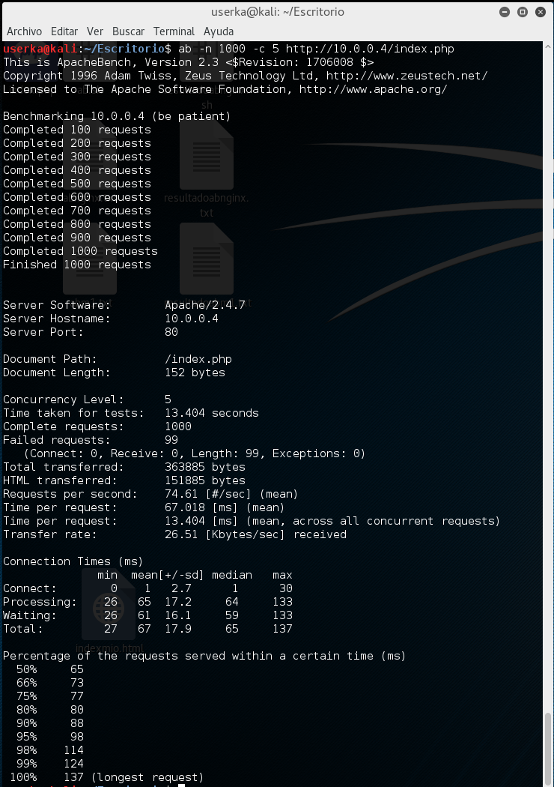
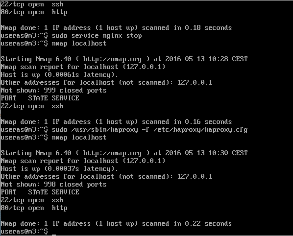
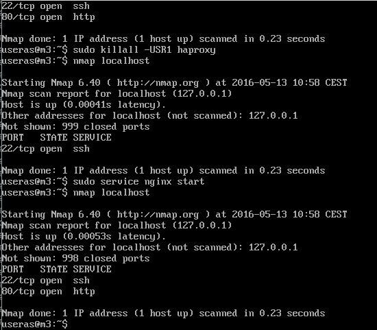
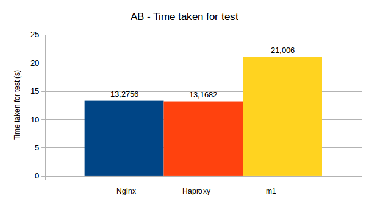
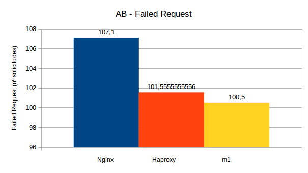
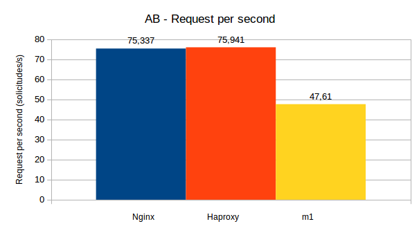
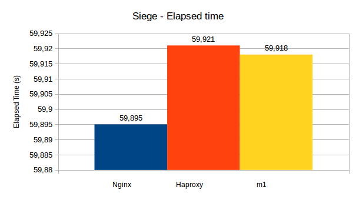
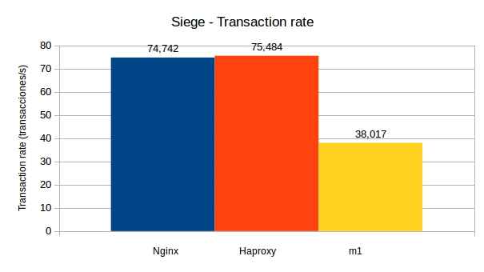
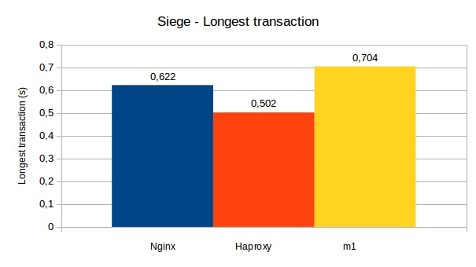

#PRACTICA 4


##Script php ejecutado en las peticiones

```html

<HTML>
<HEAD>
<TITLE>APACHE BENCHMARK</TITLE>
</HEAD>
<BODY>
M1 o M2 funciona, archivo para realizar el benchmark

```

```php

<?php
$tiempo_inicio = microtime(true);
for ($i=0; $i<100000; $i++){
  $a = $i * $i;
  $b = $a - $i;
  $c = $a / $b;
  $d = 1 / $c;
}
$tiempo_fin = microtime(true);
echo "Tiempo empleado: " . round($tiempo_fin - $tiempo_inicio, 4) ;
?>

```

```html

</BODY>
</HTML>

```

##Rendimiento con Apache Benchmark

Vamos a ver el rendimiento del servidor utilizando Apache Benchmark. Para ello vamos a hacer el test con el siguiente comando

```

	ab -n 1000 -c 5 http://10.0.0.4/index.php

```



En ese ejemplo se hace una prueba con haproxy de balanceador, y con el script php en m1 y m2.

Para las ejecuciones he creado un script para hacer la ejecución y otro para filtrar resultados, a los que iré cambiando el nombre de salida y la máquina donde se van a hacer las peticiones. Además también habrá que alternar entre NGINX y HAPROXY.

**Script de ejecución**

```bash

#! /bin/bash
for ((i = 0; i < 10; i++))
do
	ab -n 1000 -c 5 http://10.0.0.4/index.php >> /home/userka/Escritorio/abhaproxy.txt
	printf "\n\n\n" >> /home/userka/Escritorio/abhaproxy.txt
done

```

**Script filtro resultados**

```bash

#! /bin/bash

cat abhaproxy.txt | grep -i taken >> resultadoabhaproxy.txt
cat abhaproxy.txt | grep -i failed >> resultadoabhaproxy.txt
cat abhaproxy.txt | grep -i "per second" >> resultadoabhaproxy.txt

```
Ejecuto los scripts y obtenemos las salidas que estarán adjuntas en el directorio datos

Iniciamos HAPROXY para realizar los benchmarks



Un ejemplo del resultado filtrado de la salida de AB para la ejecución con HAPROXY, con el que tenemos el tiempo, los fallos y las peticiones por segundo de las diez ejecuciones y haremos la media y la desviación.

```
Time taken for tests:   13.258 seconds
Time taken for tests:   13.171 seconds
Time taken for tests:   13.207 seconds
Time taken for tests:   13.187 seconds
Time taken for tests:   13.133 seconds
Time taken for tests:   13.127 seconds
Time taken for tests:   13.139 seconds
Time taken for tests:   13.184 seconds
Time taken for tests:   13.133 seconds
Time taken for tests:   13.143 seconds
Failed requests:        104
Failed requests:        117
Failed requests:        95
Failed requests:        102
Failed requests:        101
Failed requests:        91
Failed requests:        86
Failed requests:        103
Failed requests:        111
Failed requests:        108
Requests per second:    75.43 [#/sec] (mean)
Requests per second:    75.92 [#/sec] (mean)
Requests per second:    75.72 [#/sec] (mean)
Requests per second:    75.83 [#/sec] (mean)
Requests per second:    76.15 [#/sec] (mean)
Requests per second:    76.18 [#/sec] (mean)
Requests per second:    76.11 [#/sec] (mean)
Requests per second:    75.85 [#/sec] (mean)
Requests per second:    76.14 [#/sec] (mean)
Requests per second:    76.08 [#/sec] (mean)

```

Para seguir con las ejecuciones, tendremos que parar HAPROXY y ejecutar NGINX, como se muestra en la siguiente imagen



Una vez ejecutado todo, obtenemos los siguientes datos de AB y Siege, con los que luego desarrollaremos las gráficas.


A continuación tenemos la tabla con los datos filtrados para AB.
El promedio y la desviación, además de las gráficas.

###Datos de AB

| Time taken for test (s) | Failed request (solicitudes) | Request per second (solicitudes/s)
:--------------: | :------------: | :---------------: | :---------------:
**Nginx** | 13,2756 ± 0,1648 | 107,1 ± 6,2262 | 75,337 ± 0,9362
**Haproxy** | 13,1682 ± 0,04195 | 101,5555 ± 9,2712 | 75,941 + 0,2402
**m1**| 21,006 ± 0,2417 | 100,5 ± 10,0912 | 47,61 ± 0,5413








##Rendimiento con Siege

Utilizamos el script modificandolo para ejecutar siege y obtenemos los datos. Un ejemplo de los resultados para NGINX filtrados:

```
Availability:		      100.00 %
Availability:		      100.00 %
Availability:		      100.00 %
Availability:		      100.00 %
Availability:		      100.00 %
Availability:		      100.00 %
Availability:		      100.00 %
Availability:		      100.00 %
Availability:		      100.00 %
Availability:		      100.00 %
Elapsed time:		       59.34 secs
Elapsed time:		       59.93 secs
Elapsed time:		       59.97 secs
Elapsed time:		       59.96 secs
Elapsed time:		       59.95 secs
Elapsed time:		       59.97 secs
Elapsed time:		       59.94 secs
Elapsed time:		       59.98 secs
Elapsed time:		       59.97 secs
Elapsed time:		       59.94 secs
Response time:		        0.20 secs
Response time:		        0.20 secs
Response time:		        0.20 secs
Response time:		        0.20 secs
Response time:		        0.20 secs
Response time:		        0.20 secs
Response time:		        0.20 secs
Response time:		        0.20 secs
Response time:		        0.20 secs
Response time:		        0.20 secs
Transaction rate:	       75.14 trans/sec
Transaction rate:	       74.34 trans/sec
Transaction rate:	       74.97 trans/sec
Transaction rate:	       74.98 trans/sec
Transaction rate:	       74.90 trans/sec
Transaction rate:	       74.54 trans/sec
Transaction rate:	       74.81 trans/sec
Transaction rate:	       74.71 trans/sec
Transaction rate:	       74.82 trans/sec
Transaction rate:	       74.21 trans/sec
Failed transactions:	           0
Failed transactions:	           0
Failed transactions:	           0
Failed transactions:	           0
Failed transactions:	           0
Failed transactions:	           0
Failed transactions:	           0
Failed transactions:	           0
Failed transactions:	           0
Failed transactions:	           0
Longest transaction:	        0.54
Longest transaction:	        0.65
Longest transaction:	        0.59
Longest transaction:	        0.55
Longest transaction:	        0.64
Longest transaction:	        0.75
Longest transaction:	        0.62
Longest transaction:	        0.59
Longest transaction:	        0.57
Longest transaction:	        0.72

```

###Datos de Siege

Para Nginx, Haproxy y m1 estos resultados son comunes
Availability: 100%
Failed transactions: 0

Para Nginx y Haproxy hay un tiempo de respuesta:
Response time: 0,20

Para m1 el tiempo de respuesta es:
Response time: 0,39

| Elapsed time (s) | Transaction rate (transacciones/s) | Longest transaction (s)
:--------------: | :------------: | :---------------: | :---------------:
**Nginx** | 59,895 ± 0,1956 | 74,742 ± 0,2961 | 0,622 ± 0,0697
**Haproxy** | 59,921 ± 0,1659 | 75,484 ± 0,7253 | 0,502 + 0,0582
**m1**| 59,918 ± 0,1751 | 38,017 ± 0,0834 | 0,704 ± 0,0977








Todos los ficheros de salida se encuentran en la carpeta Datos, al igual que el excel con las tablas y gráficas