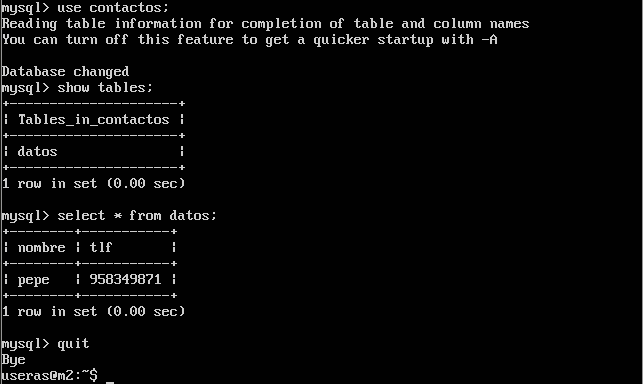

#PRACTICA 5


##Creación base de datos MySQL

Para interactuar con MYSQL, abrimos la consola con:

```

mysql -uroot -p

```

Ponemos la contraseña y ya podemos ejecutar comandos. En las siguientes imagenes creamos una base de datos e insertamos tablas y datos.


##Replicar la BD con MySQLDump

Para replicar manualmente la base de datos podemos usar MySQLDump, que es una herramienta que viene como parte del cliente de MySQL.
Antes de ejecutar tenemos que bloquear las lecturas de la base de datos para poder realizar la copia de seguridad.

```

	mysql -u root -p
	FLUSH TABLES WITH READ LOCK;
	quit

```

Después ya podemos realizar la copia de seguridad con el siguiente comando

```

	mysqldump contactos -u root -p > ./contactos.sql

```


Finalmente ya podemos desbloquear la base de datos para que se pueda seguir ejecutando y copiamos con SCP el resultado en m2

```

	mysql -u root -p
	UNLOCK TABLES;
	quit
	scp ./contactos.sql root@10.0.0.3:/root/contactos.sql

```


Ahora en m2, creamos la base de datos contactos. Ya podemos restaurar la copia en m2

```

	CREATE DATABASE contactos;
	sudo cp /root/contactos.sql /home/useras/contactos.sql
	mysql -u root -p contactos < /home/useras/contactos.sql

```


Por último comprobamos que la base de datos se ha grabado correctamente:

```

	use contactos;
	show tables;
	select * from datos;

```



##Replicar la base de datos con maestro-esclavo


Para replicar la base de datos automáticamente, tenemos que cambiar el fichero de configuración con lo siguiente.

En el maestro:

```

	#bind-address 127.0.0.1
	log_error = /var/log/mysql/error.log
	server-id = 1
	log_bin = /var/log/mysql/bin.log

```

En el esclavo:

```

	#bind-address 127.0.0.1
	log_error = /var/log/mysql/error.log
	server-id = 2
	log_bin = /var/log/mysql/bin.log

```

Reiniciamos el servicio en las dos maquinas con:

```

sudo service mysql start

```

Usando *service mysql restart* se reinicia el servicio bien, sin embargo con init.d daba errores como el siguiente, que según he leído, es porque no init.d no cerraba bien el servicio:


Ya podemos crearel maestro esclavo. 
Para el master ejecutamos los siguientes comandos como muestra la siguiente imagen, además de ver el STATUS en el que se queda:


En el slave ejecutamos:


Y vemos el estado del slave, el cual tiene *Seconds_Behind_Master* a cero, que es el estado correcto:


Ya finalmente nos queda ver cómo cuando creamos nuevas tablas en el master, automáticamente se replican en el slave. Para ello creamos datos2 e incluimos una entrada.


Vemos las dos máquinas con los mismos datos, que automáticamente se han replicado en m2:

