#PRACTICA 6


##Configurar RAID por software

Para configurar el RAID utilizaré la m3.
Añadire dos discos de 1GB cada uno a la maquina virtual, 1RAID.vdi y 2RAID.vdi

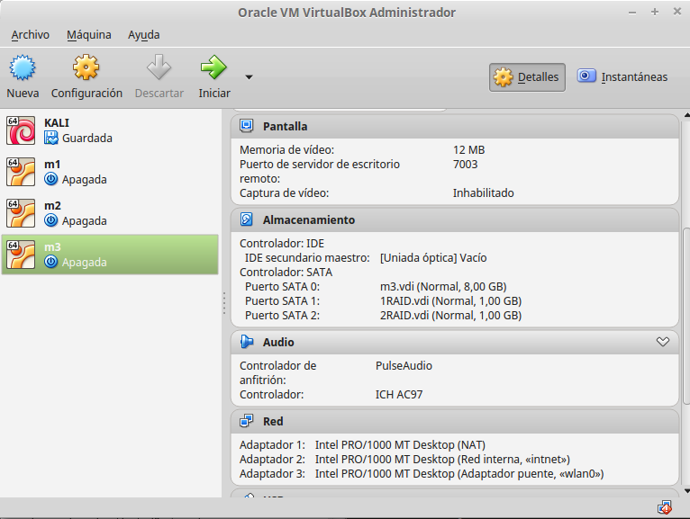
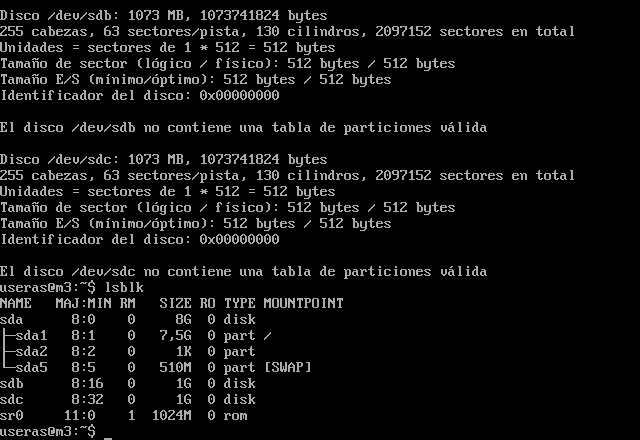

A continuación creamos el RAID con:

```

sudo mdadm -C /dev/md0 --level=raid1 --raid-devices=2 /dev/sdb /dev/sdc

```

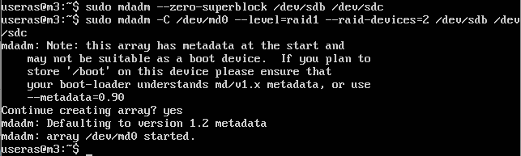

Y formateamos el nuevo dispositivo md0 con *mkfs*

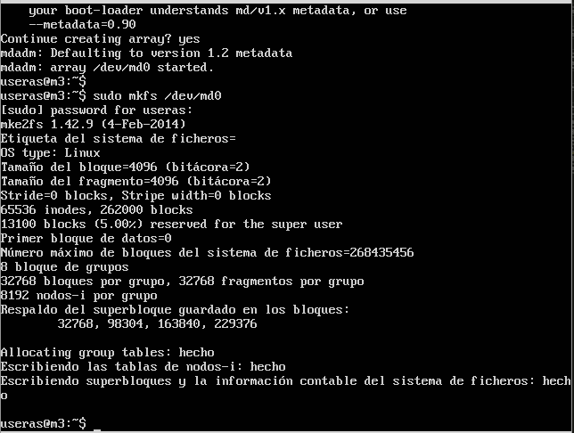

Creamos un directorio en el que montaremos el disco md0, y vemos al final de la imagen que */dev/md0* está en */dat* con formato *ext2*

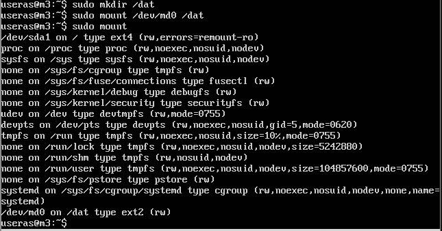

Con el siguiente comando vemos los detalles del RAID activo

```

sudo mdadm --detail /dev/md0

```

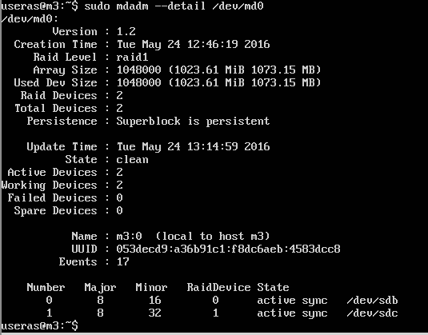

Vemos el UUID del dispositivo para poder ponerlo en fstab

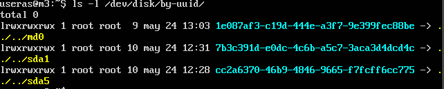

Metemos el dispositivo en el archivo fstab, que queda de la siguiente forma:

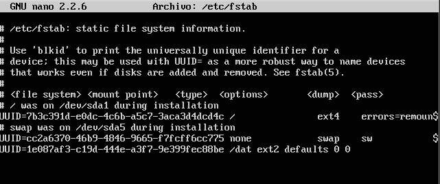

Y después reiniciamos, y vemos que se ha montado automáticamente con *sudo mount* y además vemos que se ha renombrado a *md127*

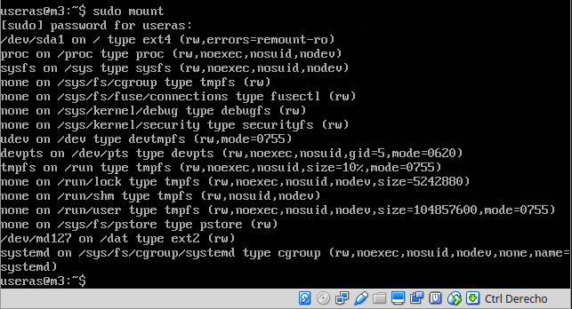

Ahora vamos a generar un fallo en un disco

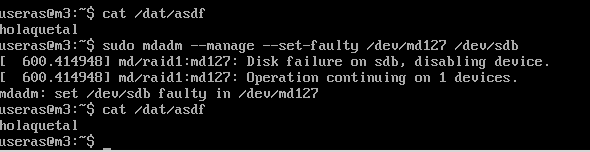

Podemos ver que cuando el disco pasa a estar en fallo, deja de usarse y se continúa con un dispositivo, además de la comprobación de acceder al fichero *asdf*, el cual se lee perfectamente.

Eliminamos el disco en caliente:

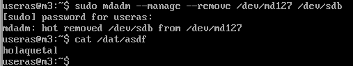

Con el comando siguiente podemos volver a añadir el disco:

```

sudo mdadm --manage --add /dev/md127 /dev/sdb

```

##Parte adicional: Servidor NFS

###Servidor

Para tener un NFS, vamos a instalar el server con apt

```

sudo apt-get install nfs-common nfs-kernel-server

```

Ahora, en /etc/exports vamos a configurar las carpetas compartidas y los permisos para los usuarios

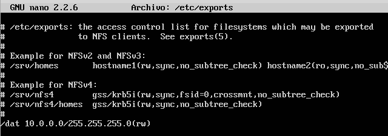

Ahora reiniciamos el servicio y le damos permisos a la carpeta

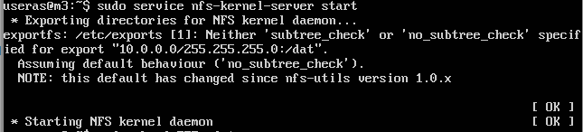

###Clientes

Para tener el servicio de los clientes, vamos a instalar el paguete *nfs-common*

```

sudo apt-get install nfs-common

```

Montamos la carpeta en un directorio local llamado *carpetanfs*

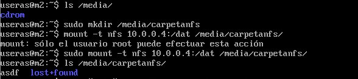

Una vez montado, intentamos escribir un archivo, no nos deja porque aunque tengamos permisos de escritura y lectura en el fichero de configuración NFS, también en el sistema de la m3 debemos tener permisos para los usuarios en esa carpeta.
Por lo que como se puede ver en la siguiente imagen, le damos permisos y ya tenemos acceso de escritura en la carpeta NFS.

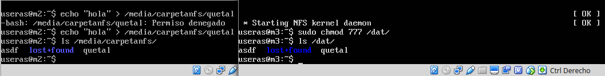