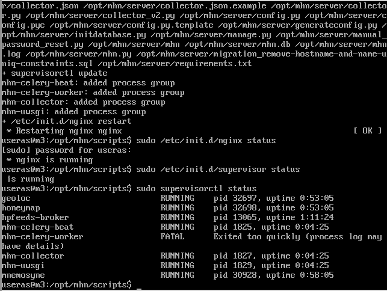
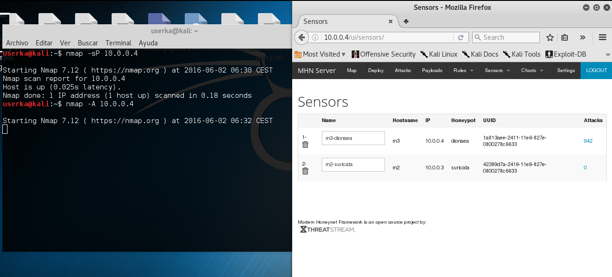
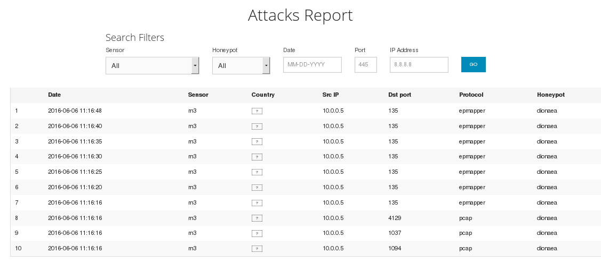
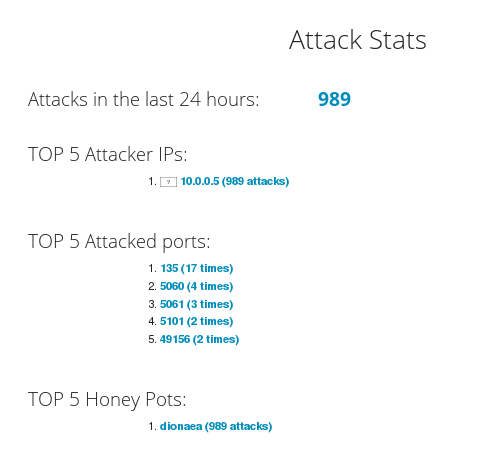

#Honeypot Modern Honey Network


Un Honeypot es un software o conjunto de máquinas que tienen la intención de atraer atacantes simulando vulnerabilidades o ser fácilmente atacables.

Con ella podemos sacar información sobre los atacantes, siendo capaces de obtener las técnicas que están siendo utilizadas para el ataque, además de poder alejar el ataque de las máquinas críticas y avisar al administrador del sistema que está siendo atacado.


##Instalación de MHN

Para la instalación de MHN, crearemos una maquina virtual con Ubuntu Server en VirtualBox.
Una vez creada la VM con una instalación limpia, sin interfaz gráfica ni complementos, iniciamos el sistema e instalar los siguientes paquetes

```

sudo apt-get install git python gcc automake -y

```

Una vez instalado, copiamos el repositorio github de MHN

```

git clone https://github.com/threatstream/mhn.git

```


Vamos a la carpeta de scripts y ejecutamos los scripts necesarios que instalan MHN:

```

cd mhn/scripts/
sudo ./install_hpfeeds.sh
sudo ./install_mnemosyne.sh
sudo ./install_honeymap.sh

```

Después de un buen rato instalando los scripts, procedemos a instalar y configurar el servidor MHN con el siguiente script

```

sudo ./install_mhnserver.sh

```

En las siguientes capturas nos pregunta ciertos datos.

* Le decimos que no queremos ejecutar en modo depuración
* Ponemos la dirección de usuario y dos veces la contraseña de acceso
* Dejamos la url, y la dirección y puerto de correo por defecto
* No aceptamos usar TLS ni SSL para el email
* Los demás parámetros los dejamos por defecto

Se puede observar que el archivo log estará en **/var/log/mhn/mhn.log**


Vemos el estado del honeypot MHN con los siguientes comandos:

```

sudo /etc/init.d/nginx status
sudo /etc/init.d/supervisor status
sudo supervisorctl status

```



Como se puede ver en la imagen, da errores en *mhn-celery-worker*. Este problema es provocado por los permisos y se soluciona ejecutando lo siguiente:

```

sudo chown www-data /var/log/mhn/mhn.log
sudo supervisorctl restart all

```


Ahora desde otra maquina virtual podemos ver en el navegador el honeymap de MHN, accediendo con la IP de la VM con MHN y el puerto 3000, antes fijados en la configuración e instalación de MHN


Accediendo a la IP 10.0.0.4 de la VM con MHN entramos en la pantalla de login, donde tendremos que poner el nombre y usuario antes fijados en la instalación


Una vez esté funcionando, ya podemos configurar MHN.

##Sensores

Los sensores son apliciones externas a MHN que se pueden desplegar en servidores remotos y en el local, con los que podremos detectar los ataques y cruzar datos en la consola central de MHN

Vamos a instalar dionaea. Este honeypot es capaz de capturar y analizar el malware. Levanta varios servicios y espera que los atacantes intenten hacerse con el control de los servicios por medio de payloads y peticiones maliciosas.

Para ello seleccionamos Deploy en el menú superior y nos aparece un desplegable, en el cual damos click en Ubuntu - Dionaea.

Esta acción nos devuelve automáticamente un comando que nos descargará el script el cual ejecutará la instalación.

Cambiamos la IP por la de la maquina virtual 10.0.0.4 para acceder al servidor. Lo vamos a instalar en el propio servidor:

```

wget "http://10.0.0.4/api/script/?text=true&script_id=2" -O deploy.sh && sudo bash deploy.sh http://10.0.0.4 J865oGpA

```


También en otra VM vamos a instalar suricata
Suricata es una red de alto rendimiento, IPS y motor de supervisión de la seguridad de red. Es Open Source.
Es altamente escalable, multiproceso por lo que se pueden ejecutar varias instancias.
Reconoce automáticamente los protocolos más comunes, por lo que las reglas son escritas para el protocolo, no para un puerto especificado.
También identifica miles de tipos de archivos y puede analizarlos, hacer el MD5, etc.

Para instalarlo volvemos a la pantalla Deploy y seleccionamos Ubuntu - Suricata


```

wget "http://10.0.0.4/api/script/?text=true&script_id=13" -O deploy.sh && sudo bash deploy.sh http://10.0.0.4 J865oGpA

```


Una vez terminada la instalación, en el menú *Sensors > View Sensors* podemos ver los sensores que tenemos desplegados:


Ya tenemos instalados los sensores, ahora ya podemos hacer una simulación de ataque, en el que usaremos la herramienta **nmap** que hace un escaneo de puertos además de otras utilidades. Vamos a utilizar el comando **-A 10.0.0.4**



Como podemos observar en la imagen, al hacer el nmap, refrescamos la web de sensores y vemos que hay ataques realizados a ese sensor.

Si nos metemos en la pestaña Attacks del menu principal de MHN podemos ver los ataques que se han realizado, desde la IP que se han hecho y a qué puertos se ha intentado acceder.



Con esto somos capaces de reconocer un ataque y cuál es el objetivo de los atacantes.

En la página principal de MHN tenemos un resumen de los ataques




##Bibliografia

[Repo MHN Github](https://github.com/threatstream/mhn)

[Instalar MHN, dejando un tarro de miel en internet](https://www.joanesmarti.com/modern-honeypot-network-dejando-un-tarro-de-miel-en-internet/)

[Suricata](https://seguridadyredes.wordpress.com/2011/02/22/ids-ips-suricata-entendiendo-y-configurando-suricata-parte-i/)

[Dionaea honeypot y gusano445.exe](http://revista.seguridad.unam.mx/numero24/poc-captura-de-malware-con-el-honeypot-dionaea-ii)
